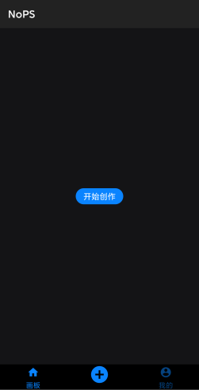
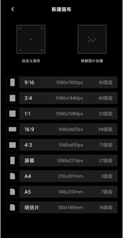
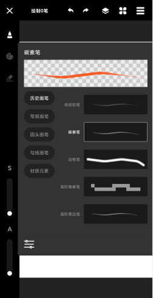
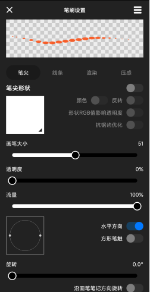
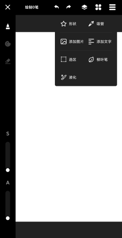
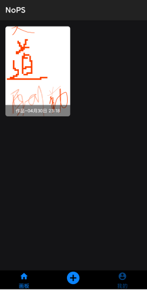

# NoPS

高阶画板

# 实现功能

- [x] 14种画笔。（部分绘制效果不好的未开放）
- [x] 图层处理。CRUD，拖拽排序
- [x] 画板旋转缩放
- [x] 选区
    - [x] 魔棒
    - [x] 画笔
    - [x] 矩形
    - [x] 圆形
    - [x] 套索
    - [x] 正选反选
    - [x] 复制剪切
- [x] 撤销重做
- [x] 文字添加、图片添加
- [x] 液化
- [x] 柳叶笔，增加删除
- [x] 吸管
- [x] 形状
  - [x] 矩形
  - [x] 圆形
  - [x] 椭圆

- [ ] 滤镜
- [ ] 3d画
- [ ] 画笔增加

# 效果

# 魔棒效果
